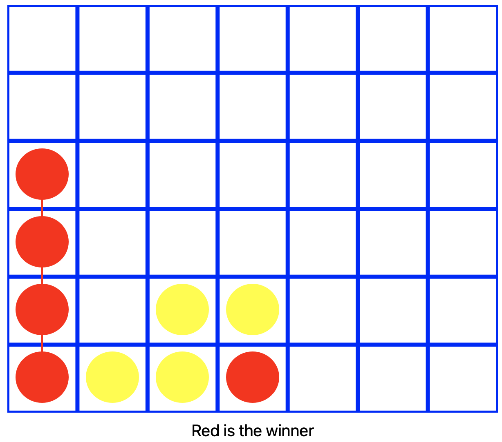

# Connect X

This is a simple macOS game where you have to connect X coins of the same color in a row (diagonally, vertically or horizontally).

### How to check if there are X items in a row?

I'm doing that based on where the coin was added. So, if added on IndexPath 0,0, I start checking around this index, so it's not necessary to check the whole board.
There still some improvements to be done, by the way.